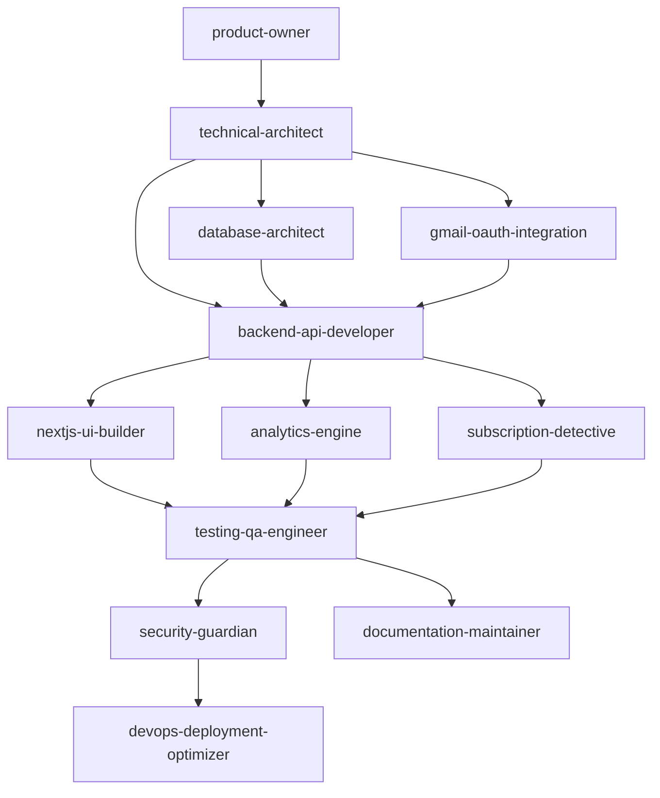
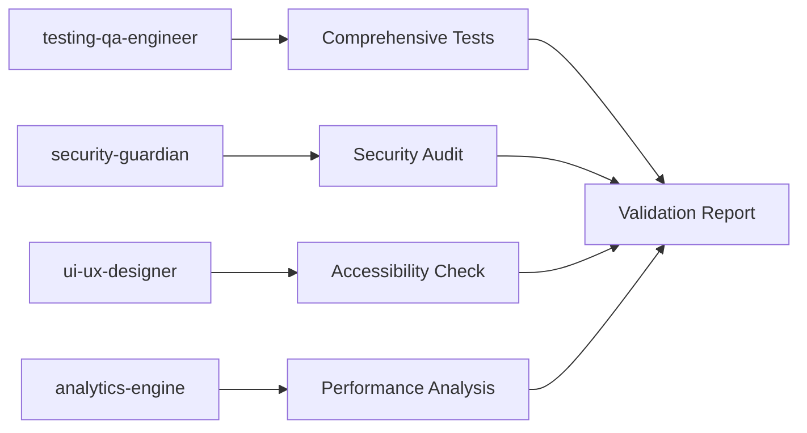

# Email Insight Agent Coordination Matrix

## Overview
This matrix defines how Claude subagents coordinate during Email Insight development, including handoff points, required deliverables, and execution order.

## Agent Workflow Chains

### Development Workflow Chain


### Validation Workflow Chain


## Agent Coordination Rules

### Sequential Dependencies (Must Execute In Order)

#### Phase 0: Planning
1. **product-owner** validates requirements
   - **Output**: Requirements document, acceptance criteria
   - **Next**: technical-architect

2. **technical-architect** designs solution
   - **Input**: Requirements from product-owner
   - **Output**: Technical design, API specs, data models
   - **Next**: Implementation agents (database, gmail, backend)

#### Phase 1: Foundation
3. **database-architect** implements schema
   - **Input**: Technical design from technical-architect
   - **Output**: Database schema, migrations, indexes
   - **Next**: backend-api-developer

#### Phase 2: Integration
4. **gmail-oauth-integration** implements Gmail API
   - **Input**: Technical design from technical-architect
   - **Output**: OAuth2 flow, Gmail client, token management
   - **Next**: backend-api-developer

5. **backend-api-developer** creates API endpoints
   - **Input**: Database schema + Gmail integration
   - **Output**: REST API, middleware, validation
   - **Next**: frontend (nextjs-ui-builder), analytics, subscription detection

#### Phase 3: Intelligence
6. **analytics-engine** implements data processing
   - **Input**: API endpoints and database from backend-api-developer
   - **Output**: Analytics calculations, materialized views
   - **Next**: testing-qa-engineer

7. **subscription-detective** implements detection logic
   - **Input**: API endpoints and database from backend-api-developer
   - **Output**: Subscription detection algorithms, classification
   - **Next**: testing-qa-engineer

#### Phase 4: Interface  
8. **nextjs-ui-builder** creates frontend
   - **Input**: API endpoints from backend-api-developer
   - **Output**: React components, pages, styling
   - **Next**: testing-qa-engineer

### Parallel Execution (Can Run Simultaneously)

#### Implementation Phase Parallel Tracks
- **analytics-engine** + **subscription-detective** (after backend-api complete)
- **nextjs-ui-builder** + **unsubscribe-specialist** (after backend-api complete)

#### Validation Phase Parallel Tracks  
- **testing-qa-engineer** + **security-guardian** + **ui-ux-designer**
- **documentation-maintainer** (can run parallel with testing)

## Handoff Requirements

### product-owner → technical-architect
**Required Deliverables:**
- Product requirements document (PRD)
- User stories with acceptance criteria
- Business constraints and priorities
- Success metrics definition

**Handoff Format:**
```json
{
  "requirements": {
    "userStories": [...],
    "acceptanceCriteria": [...],
    "businessConstraints": [...],
    "successMetrics": [...]
  },
  "approvalStatus": "approved",
  "nextPhase": "technical-design"
}
```

### technical-architect → Implementation Agents
**Required Deliverables:**
- System architecture diagrams
- API specification (OpenAPI)
- Database design and relationships
- Component interaction patterns
- Performance requirements

**Handoff Format:**
```json
{
  "architecture": {
    "systemDesign": "...",
    "apiSpec": "...",
    "databaseDesign": "...",
    "componentPatterns": "..."
  },
  "technicalRequirements": {
    "performance": {...},
    "security": {...},
    "scalability": {...}
  }
}
```

### database-architect → backend-api-developer
**Required Deliverables:**
- Complete database schema (Drizzle)
- Migration scripts (up/down)
- Indexes and optimization
- FTS5 search configuration
- Data access layer patterns

**Handoff Format:**
```json
{
  "database": {
    "schema": "schema.ts file",
    "migrations": ["migration files"],
    "indexes": [...],
    "fts5Config": "...",
    "dataAccessLayer": "data access patterns"
  },
  "performance": {
    "queryOptimizations": [...],
    "indexUsage": "..."
  }
}
```

### backend-api-developer → Frontend/Intelligence Agents
**Required Deliverables:**
- REST API endpoints (all routes working)
- Authentication middleware
- Request/response validation
- Error handling patterns
- API documentation

**Handoff Format:**
```json
{
  "api": {
    "endpoints": [...],
    "authentication": "JWT implementation",
    "validation": "request/response schemas",
    "errorHandling": "error patterns",
    "documentation": "API docs"
  },
  "testingInfo": {
    "testEndpoints": [...],
    "sampleData": "..."
  }
}
```

### Implementation → testing-qa-engineer
**Required Deliverables:**
- Complete implementation (all code)
- Unit tests (existing)
- Integration points documented
- Performance benchmarks
- Known issues/limitations

**Handoff Format:**
```json
{
  "implementation": {
    "codeComplete": true,
    "unitTests": "coverage %",
    "integrationPoints": [...],
    "performanceBenchmarks": {...}
  },
  "testingRequirements": {
    "criticalPaths": [...],
    "edgeCases": [...],
    "performanceTargets": {...}
  }
}
```

### testing-qa-engineer → security-guardian
**Required Deliverables:**
- Test results (all passed)
- Code coverage report
- Performance validation
- Integration test results
- Identified security test points

**Handoff Format:**
```json
{
  "testing": {
    "results": "all tests passed",
    "coverage": ">80%",
    "performance": "within targets",
    "securityTestPoints": [...]
  },
  "securityFocus": {
    "authenticationFlows": [...],
    "dataHandling": [...],
    "apiSecurity": [...]
  }
}
```

### All Validation → devops-deployment-optimizer
**Required Deliverables:**
- All tests passing
- Security clearance
- Performance validated
- Documentation complete
- Deployment readiness confirmed

**Handoff Format:**
```json
{
  "deploymentReadiness": {
    "testsStatus": "all passed",
    "securityStatus": "approved",
    "performanceStatus": "meets targets",
    "documentationStatus": "complete"
  },
  "deploymentConfig": {
    "environment": "production",
    "resources": {...},
    "monitoring": {...}
  }
}
```

## Error Handling and Escalation

### Agent Failure Escalation
1. **Implementation Agent Fails** → Escalate to **technical-architect**
2. **Technical Issue** → Escalate to **technical-architect**
3. **Requirements Issue** → Escalate to **product-owner**
4. **Security Concern** → Immediately invoke **security-guardian**
5. **Deployment Failure** → **devops-deployment-optimizer** handles rollback

### Conflict Resolution
- **Technical vs Product Requirements**: **product-owner** + **technical-architect** collaborate
- **Security vs Performance**: **security-guardian** has final say on security
- **Timeline vs Quality**: **product-owner** makes final call
- **Architecture Violations**: **technical-architect** has veto power

## Success Criteria for Each Handoff

### Requirements → Design
- [ ] All user stories have acceptance criteria
- [ ] Technical constraints identified
- [ ] Success metrics defined
- [ ] Stakeholder approval obtained

### Design → Implementation
- [ ] Complete technical specifications
- [ ] API contracts defined
- [ ] Database relationships mapped
- [ ] Architecture patterns documented

### Implementation → Testing
- [ ] All features functionally complete
- [ ] Basic unit tests passing
- [ ] Integration points working
- [ ] Documentation updated

### Testing → Security
- [ ] All tests passing (>80% coverage)
- [ ] Performance benchmarks met
- [ ] No critical bugs found
- [ ] Security test points identified

### Validation → Deployment
- [ ] Security clearance obtained
- [ ] All tests passing consistently
- [ ] Performance targets achieved
- [ ] Documentation complete and current

## Agent Invocation Examples

### Sequential Chain
```javascript
// 1. Requirements
const requirements = await invokeAgent("product-owner", requirementsTask)

// 2. Technical Design (depends on requirements)
const design = await invokeAgent("technical-architect", {
  task: "Design system",
  context: { requirements: requirements.deliverables }
})

// 3. Database Implementation (depends on design)
const database = await invokeAgent("database-architect", {
  task: "Implement schema",
  context: { design: design.deliverables }
})

// 4. API Implementation (depends on database)
const api = await invokeAgent("backend-api-developer", {
  task: "Create endpoints",
  context: { 
    design: design.deliverables,
    database: database.deliverables 
  }
})
```

### Parallel Execution
```javascript
// After API is complete, these can run in parallel
const [frontend, analytics, subscriptions] = await Promise.all([
  invokeAgent("nextjs-ui-builder", frontendTask),
  invokeAgent("analytics-engine", analyticsTask),
  invokeAgent("subscription-detective", subscriptionTask)
])

// Validation agents can also run in parallel
const [testing, security, accessibility] = await Promise.all([
  invokeAgent("testing-qa-engineer", testingTask),
  invokeAgent("security-guardian", securityTask),
  invokeAgent("ui-ux-designer", accessibilityTask)
])
```