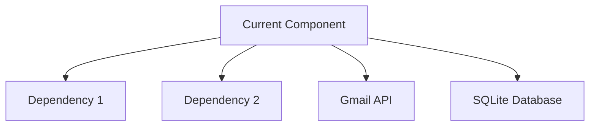

# Create Email Insight GitHub Issue

## Introduction
Transform Email Insight roadmap items into well-structured GitHub issues tailored for multi-agent development. This command extracts context from project documentation, assigns appropriate agents, and ensures alignment with the 6-phase development workflow.

## Prerequisites
- GitHub CLI (`gh`) installed and authenticated
- Access to the Email Insight repository
- Understanding of the roadmap item or feature to document

## Feature Description
<feature_description> #$ARGUMENTS </feature_description>

## Main Tasks

### 1. Email Insight Context Gathering
**Project Documentation Research:**
- [ ] Review `/docs/roadmap.md` for phase alignment and deliverables
- [ ] Check `/docs/agents.md` for agent responsibilities and coordination
- [ ] Examine `/docs/architecture.md` for technical constraints and patterns
- [ ] Review `/docs/api-spec.md` for API design requirements
- [ ] Check `/docs/database-schema.md` for data modeling needs
- [ ] Analyze existing issues for Email Insight formatting patterns and labels

**Roadmap Context Analysis:**
- [ ] Identify which development phase (1-6) the issue belongs to:
  - Phase 1: Foundation (Project Setup + Database Architecture)
  - Phase 2: Integration (Gmail API + Backend API)
  - Phase 3: Intelligence (Analytics + Subscription Detection)
  - Phase 4: Interface (Frontend UI + Unsubscribe Functionality)
  - Phase 5: Quality (Security + Testing)
  - Phase 6: Deployment (DevOps + Documentation)
- [ ] Determine lead and support agent assignments
- [ ] Identify Product Owner, Technical Architect, and UI/UX Designer review requirements
- [ ] Check for cross-phase dependencies and coordination needs

**Multi-Agent Coordination Research:**
- [ ] Identify primary agent responsible (lead)
- [ ] Determine supporting agents needed
- [ ] Note required handoff interfaces and deliverables
- [ ] Check for leadership agent approval requirements
- [ ] Document integration points with other agents' work

### 2. Agent Assignment & Coordination Planning
**Primary Agent Identification:**
- [ ] Assign lead agent based on expertise area:
  - `@agent-project-setup` (Project structure, TypeScript config)
  - `@agent-database-architect` (SQLite, schema design, FTS5)
  - `@agent-gmail-integration` (OAuth2, Gmail API, sync)
  - `@agent-backend-api` (Hono, REST endpoints, middleware)
  - `@agent-subscription-detective` (Pattern recognition, detection algorithms)
  - `@agent-analytics-engine` (Statistics, data processing, aggregation)
  - `@agent-frontend-ui` (React, Next.js, dashboards)
  - `@agent-unsubscribe-specialist` (RFC 8058, link extraction)
  - `@agent-security-guardian` (Encryption, validation, OWASP)
  - `@agent-testing-qa` (Jest, E2E, coverage)
  - `@agent-devops` (Docker, CI/CD, deployment)
  - `@agent-documentation` (Technical writing, API docs)

**Leadership Agent Reviews:**
- [ ] Determine if `@agent-product-owner` approval required
- [ ] Check if `@agent-technical-architect` review needed
- [ ] Identify if `@agent-ui-ux-designer` review required

**Supporting Agent Coordination:**
- [ ] List supporting agents needed for implementation
- [ ] Define handoff requirements and interfaces
- [ ] Document integration testing needs
- [ ] Plan for cross-agent communication

### 3. Choose Implementation Detail Level

#### 📄 ROADMAP QUICK ISSUE
**Best for:** Straightforward roadmap items, single-agent tasks
**Includes:**
- Roadmap context and phase alignment
- Agent assignment and basic coordination
- Essential acceptance criteria
- Tech stack constraints

#### 📋 MULTI-AGENT STANDARD
**Best for:** Most roadmap features requiring agent coordination
**Includes everything from ROADMAP QUICK plus:**
- Detailed agent handoff requirements
- Leadership agent review checkpoints
- Cross-phase dependencies
- Integration testing requirements
- Email Insight architecture alignment

#### 📚 COMPREHENSIVE ROADMAP ISSUE
**Best for:** Major phase milestones, complex multi-agent features
**Includes everything from MULTI-AGENT STANDARD plus:**
- Detailed implementation plan with agent phases
- Complete handoff interface specifications
- Risk mitigation for agent coordination
- Performance benchmarks and success criteria
- Future extensibility within Email Insight context

### 4. Email Insight Issue Creation & Formatting

**Title Format:**
```
[Phase X] Feature Description - @lead-agent
```
Examples:
- `[Phase 1] SQLite Database Setup with FTS5 - @agent-database-architect`
- `[Phase 2] Gmail API Integration with OAuth2 - @agent-gmail-integration`
- `[Phase 4] Subscription Manager Dashboard UI - @agent-frontend-ui`

**Email Insight Labels:**
- **Phase Labels**: `phase-1-foundation`, `phase-2-integration`, `phase-3-intelligence`, `phase-4-interface`, `phase-5-quality`, `phase-6-deployment`
- **Agent Labels**: `agent-database`, `agent-gmail`, `agent-backend`, `agent-frontend`, `agent-analytics`, `agent-subscription`, `agent-security`, `agent-testing`, `agent-devops`, `agent-docs`
- **Component Labels**: `gmail-api`, `sqlite-database`, `hono-backend`, `nextjs-frontend`, `oauth2`, `analytics-engine`, `subscription-detection`, `unsubscribe-flow`
- **Priority Labels**: `roadmap-critical`, `roadmap-important`, `roadmap-nice-to-have`
- **Review Labels**: `needs-product-approval`, `needs-architect-review`, `needs-design-review`

**Content Sections:**
- [ ] **Roadmap Context**: Phase, milestone, and deliverable alignment
- [ ] **Agent Assignment**: Primary and supporting agents with responsibilities
- [ ] **Architecture Alignment**: References to relevant docs and patterns
- [ ] **Leadership Reviews**: Required approvals and checkpoints
- [ ] **Handoff Requirements**: Interfaces, tests, and documentation needed
- [ ] **Email Insight Integration**: How this fits with existing components
- [ ] **Success Metrics**: Specific to Email Insight performance targets

### 5. Final Review & Submission

**Email Insight Pre-submission Checklist:**
- [ ] Title includes phase and lead agent assignment
- [ ] Roadmap phase and milestone clearly identified
- [ ] Agent coordination requirements documented
- [ ] Leadership review requirements specified
- [ ] Email Insight architecture references included
- [ ] Integration points with other agents defined
- [ ] Success criteria align with roadmap goals

## Email Insight Issue Templates

### Template: Roadmap Quick Issue

```markdown
## 📋 Roadmap Context
**Phase**: [Phase X - Name]
**Milestone**: [MVP/Beta/v1.0]
**Lead Agent**: @agent-[name]
**Supporting Agents**: @agent-[name], @agent-[name]

## 🎯 Feature Description
[Brief description of the roadmap item]

## 📐 Architecture References
- [ ] `/docs/architecture.md` - [Relevant section]
- [ ] `/docs/api-spec.md` - [API endpoints affected]
- [ ] `/docs/database-schema.md` - [Tables/queries involved]

## ✅ Acceptance Criteria
- [ ] [Specific, testable criterion 1]
- [ ] [Specific, testable criterion 2]
- [ ] [Specific, testable criterion 3]

## 🔗 Agent Handoffs
**Receives from**: @agent-[previous] - [Interface/deliverable]
**Delivers to**: @agent-[next] - [Interface/deliverable]

## 🏆 Success Metrics
- [ ] Performance: [Specific benchmark]
- [ ] Quality: [Specific standard]
- [ ] Integration: [Specific test]
```

### Template: Multi-Agent Standard

```markdown
## 📋 Roadmap Context
**Phase**: [Phase X - Name]
**Milestone**: [MVP/Beta/v1.0]
**Roadmap Reference**: [Link to specific roadmap section]
**Lead Agent**: @agent-[name]
**Supporting Agents**: @agent-[name], @agent-[name]

## 🎯 Feature Description
[Detailed description connecting to roadmap goals and user value]

## 📐 Architecture Alignment
### Technical References
- [ ] `/docs/architecture.md` - [Specific patterns to follow]
- [ ] `/docs/api-spec.md` - [API contracts to implement]
- [ ] `/docs/database-schema.md` - [Schema changes needed]
- [ ] `/docs/gmail-integration.md` - [OAuth/API considerations]

### Design Patterns
- [ ] [Pattern 1]: [Implementation requirement]
- [ ] [Pattern 2]: [Implementation requirement]

## 👥 Agent Coordination Plan
### Lead Agent Responsibilities (@agent-[name])
- [ ] [Primary responsibility 1]
- [ ] [Primary responsibility 2]
- [ ] [Primary responsibility 3]

### Supporting Agent Tasks
**@agent-[name]:**
- [ ] [Support task 1]
- [ ] [Support task 2]

**@agent-[name]:**
- [ ] [Support task 1]
- [ ] [Support task 2]

### Leadership Reviews Required
- [ ] **@agent-product-owner**: [Review criteria]
- [ ] **@agent-technical-architect**: [Review criteria]  
- [ ] **@agent-ui-ux-designer**: [Review criteria] *(if UI/UX related)*

## 🔗 Agent Handoffs & Interfaces
### Input Requirements
**From @agent-[previous]:**
- [ ] [Deliverable 1]: [Specific interface/format]
- [ ] [Deliverable 2]: [Specific interface/format]

### Output Deliverables  
**To @agent-[next]:**
- [ ] [Deliverable 1]: [Specific interface/format]
- [ ] [Deliverable 2]: [Specific interface/format]

### Integration Testing
- [ ] [Test 1]: [Specific integration point]
- [ ] [Test 2]: [Specific integration point]

## ✅ Acceptance Criteria
### Functional Requirements
- [ ] [Specific, testable criterion 1]
- [ ] [Specific, testable criterion 2]
- [ ] [Specific, testable criterion 3]

### Email Insight Integration
- [ ] [Integration requirement 1]
- [ ] [Integration requirement 2]

### Performance Benchmarks
- [ ] [Performance target 1]
- [ ] [Performance target 2]

## 🚨 Dependencies & Risks
### Blockers
- [ ] [Dependency 1] - Blocks [specific functionality]
- [ ] [Dependency 2] - Blocks [specific functionality]

### Risk Mitigation
- [ ] [Risk 1]: [Mitigation strategy]
- [ ] [Risk 2]: [Mitigation strategy]

## 🏆 Success Metrics & Validation
### Technical Success
- [ ] [Specific technical benchmark]
- [ ] [Integration test passes]
- [ ] [Performance requirement met]

### Product Success  
- [ ] [User value delivered]
- [ ] [Roadmap milestone achieved]
- [ ] [Product owner approval obtained]
```

### Template: Comprehensive Roadmap Issue

```markdown
## 📋 Roadmap Context & Strategic Alignment
**Phase**: [Phase X - Name]
**Week**: [Week X of development timeline]
**Milestone**: [MVP/Beta/v1.0]
**Strategic Priority**: [Critical/Important/Nice-to-have]
**Roadmap Reference**: [Direct link to roadmap section]

### Business Context
[Why this feature matters for Email Insight users and business goals]

### Technical Context
[How this fits into the overall Email Insight architecture]

## 🎯 Comprehensive Feature Description
### User Stories
- As a [user type], I want [goal] so that [benefit]
- As a [user type], I want [goal] so that [benefit]

### Technical Requirements
[Detailed technical specification with architecture considerations]

### Email Insight Integration
[How this component integrates with existing Email Insight features]

## 📐 Deep Architecture Alignment
### Technical References & Patterns
- [ ] `/docs/architecture.md` - [Specific ADR and pattern references]
- [ ] `/docs/api-spec.md` - [Complete API contract specification]
- [ ] `/docs/database-schema.md` - [Schema design and migration plan]
- [ ] `/docs/gmail-integration.md` - [OAuth/API integration requirements]
- [ ] `/docs/security.md` - [Security considerations and requirements]
- [ ] `/docs/performance-architecture.md` - [Performance targets and optimization]

### Component Dependencies


### Data Flow Design
[Detailed data flow specification with inputs, processing, and outputs]

## 👥 Comprehensive Agent Coordination
### Lead Agent Implementation Plan (@agent-[name])
#### Week [X] Tasks
- [ ] [Day 1-2]: [Specific tasks with time estimates]
- [ ] [Day 3-4]: [Specific tasks with time estimates]  
- [ ] [Day 5]: [Testing and handoff preparation]

#### Deliverables & Interfaces
- [ ] **[Interface 1]**: [Complete TypeScript interface definition]
- [ ] **[Interface 2]**: [Complete TypeScript interface definition]
- [ ] **[Component]**: [Implementation with tests and documentation]

### Supporting Agent Coordination Matrix
| Agent | Responsibility | Input from | Output to | Timeline |
|-------|----------------|------------|-----------|----------|
| @agent-[name] | [Primary task] | @agent-[source] | @agent-[target] | Week [X] |
| @agent-[name] | [Support task] | @agent-[source] | @agent-[target] | Week [X] |

### Multi-Phase Leadership Reviews
#### Product Owner Review Checkpoints (@agent-product-owner)
- [ ] **Design Phase**: [Specific approval criteria]
- [ ] **Implementation Phase**: [Specific approval criteria]
- [ ] **Integration Phase**: [Specific approval criteria]
- [ ] **Final Review**: [Launch readiness criteria]

#### Technical Architecture Review (@agent-technical-architect)  
- [ ] **Architecture Design**: [Technical pattern compliance]
- [ ] **Implementation Review**: [Code quality and performance]
- [ ] **Integration Review**: [System coherence and scalability]

#### UI/UX Design Review (@agent-ui-ux-designer) *(if applicable)*
- [ ] **Design System**: [Component library alignment]
- [ ] **Accessibility**: [WCAG 2.1 AA compliance verification]
- [ ] **User Experience**: [Usability testing and approval]

## 🔗 Detailed Handoff Specifications
### Agent Interface Contracts
```typescript
// Input interface from previous agent
interface InputFromAgent {
  [property]: [type]; // [description and validation rules]
}

// Output interface to next agent  
interface OutputToAgent {
  [property]: [type]; // [description and format requirements]
}

// Handoff validation requirements
interface HandoffValidation {
  [test]: [criteria]; // [specific test and pass criteria]
}
```

### Integration Testing Protocol
- [ ] **Unit Tests**: [Coverage requirements and critical paths]
- [ ] **Integration Tests**: [Cross-agent interface testing]
- [ ] **Performance Tests**: [Specific benchmarks and load scenarios]
- [ ] **Security Tests**: [OWASP compliance and threat model validation]

## ✅ Comprehensive Acceptance Criteria
### Functional Requirements
- [ ] [User story 1 completely implemented and tested]
- [ ] [User story 2 completely implemented and tested]
- [ ] [Edge cases handled and tested]

### Email Insight Integration Requirements
- [ ] [Gmail API integration points working correctly]
- [ ] [SQLite database queries optimized and indexed]
- [ ] [Hono API endpoints responding within SLA]
- [ ] [Next.js frontend components rendering correctly]

### Performance & Scale Requirements  
- [ ] [Response time < Xms for P95 requests]
- [ ] [Database queries < Xms average execution time]
- [ ] [Memory usage < X MB under normal load]
- [ ] [Handles X concurrent users without degradation]

### Security & Privacy Requirements
- [ ] [OAuth2 tokens encrypted at rest]
- [ ] [Input validation prevents injection attacks]
- [ ] [GDPR compliance for data handling]
- [ ] [Security headers properly configured]

### Quality Gates
- [ ] [Code coverage > 80% with meaningful tests]
- [ ] [TypeScript strict mode compliance]
- [ ] [ESLint and Prettier formatting passed]
- [ ] [No critical security vulnerabilities]

## 🚨 Risk Assessment & Mitigation
### Technical Risks
| Risk | Probability | Impact | Mitigation Strategy | Owner |
|------|-------------|---------|-------------------|-------|
| [Risk 1] | [High/Med/Low] | [Critical/High/Med] | [Specific mitigation plan] | @agent-[name] |
| [Risk 2] | [High/Med/Low] | [Critical/High/Med] | [Specific mitigation plan] | @agent-[name] |

### Coordination Risks
- [ ] **Agent Handoff Failure**: [Mitigation plan]
- [ ] **Interface Mismatch**: [Validation and testing strategy]
- [ ] **Timeline Dependencies**: [Buffer and parallel work options]

### Email Insight Specific Risks
- [ ] **Gmail API Limits**: [Rate limiting and batch processing strategy]
- [ ] **Large Email Volumes**: [Pagination and performance optimization]
- [ ] **OAuth Token Management**: [Refresh and security strategy]

## 🏆 Success Metrics & KPIs
### Technical KPIs
- [ ] **API Response Time**: P95 < [X]ms, P99 < [Y]ms
- [ ] **Database Performance**: Query time < [X]ms average
- [ ] **Error Rate**: < [X]% for all operations
- [ ] **Test Coverage**: > [X]% with quality assertions

### Product KPIs  
- [ ] **User Experience**: [Specific usability metric]
- [ ] **Feature Adoption**: [Usage tracking and targets]
- [ ] **Performance Impact**: [System-wide performance maintenance]

### Email Insight Specific KPIs
- [ ] **Gmail Sync Performance**: [Emails per second processed]
- [ ] **Subscription Detection Accuracy**: > [X]% precision/recall
- [ ] **Unsubscribe Success Rate**: > [X]% completion rate
- [ ] **Analytics Calculation Time**: < [X]s for dashboard load

## 📈 Future Extensibility & Roadmap Impact
### v1.0 Considerations
[How this feature enables future roadmap items]

### Multi-User Scaling Path  
[Architecture decisions that support future multi-user functionality]

### Integration Opportunities
[Potential integrations with other email providers or features]

## 📚 Documentation Requirements
### Agent Handoff Documentation
- [ ] **Implementation Guide**: [Step-by-step process for next agent]
- [ ] **API Documentation**: [Complete interface specifications]  
- [ ] **Testing Guide**: [How to validate integration points]
- [ ] **Troubleshooting**: [Common issues and resolution steps]

### Email Insight Documentation Updates
- [ ] **Architecture Document**: [Updates to system design]
- [ ] **API Specification**: [New endpoints and schemas]
- [ ] **User Documentation**: [Feature usage instructions]
- [ ] **Developer Guide**: [Integration patterns and examples]
```

## Output Format
Present the complete issue content within GitHub CLI command format:

```bash
gh issue create \
  --title "[Phase X] Feature Description - @lead-agent" \
  --body "[COMPLETE_ISSUE_CONTENT]" \
  --label "phase-X-[name],agent-[type],[component],roadmap-[priority],needs-[review]" \
  --assignee "@agent-[name]"
```

## Email Insight Command Usage Examples

### Create a Foundation Phase Issue
```bash
email-insight-issue "SQLite database setup with FTS5 search capabilities for email storage and indexing"
```

### Create an Intelligence Phase Issue  
```bash
email-insight-issue "Subscription detection algorithm with confidence scoring and unsubscribe method extraction"
```

### Create an Interface Phase Issue
```bash
email-insight-issue "Dashboard UI with analytics visualizations and subscription management interface"
```

### Create a Cross-Phase Integration Issue
```bash
email-insight-issue "Gmail API to SQLite sync integration with incremental updates and error handling"
```

## Email Insight Success Criteria
- All issues align with 6-phase development roadmap
- Agent assignments match expertise and phase responsibilities  
- Leadership review requirements clearly specified
- Integration points between agents well-defined
- Success metrics align with Email Insight performance targets
- Documentation supports multi-agent coordination workflow